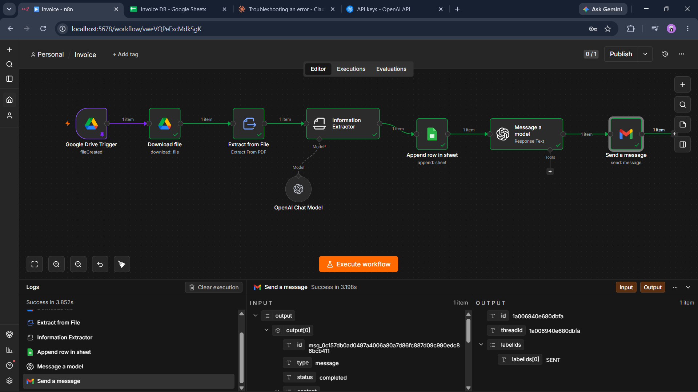

# 🧾 AI-Powered Invoice Processing Automation

An end-to-end n8n workflow that automatically extracts data from PDF invoices using AI, logs it into Google Sheets, and notifies the billing team via a fully AI-generated email — with zero manual data entry.



## 📌 Overview

Manually processing invoices is repetitive and error-prone: open the PDF, read the details, type them into a spreadsheet, then write and send an email to notify the billing team. This workflow automates that entire process.

**The result:** drop a PDF invoice into a Google Drive folder, and within seconds the data is extracted, saved to a spreadsheet, and a notification email is sent — completely hands-free.

## ⚙️ How It Works

```
Google Drive (new file)
        ↓
   Download the file
        ↓
   Extract raw text from PDF
        ↓
   AI extracts structured fields (Invoice #, Client, Amount, Dates...)
        ↓
   Save the row to Google Sheets (acts as an invoice database)
        ↓
   AI writes a professional notification email
        ↓
   Email is sent via Gmail
```

## 🧩 Node-by-Node Breakdown

| # | Node | Purpose |
|---|------|---------|
| 1 | **Google Drive Trigger** | Watches a specific Drive folder and starts the workflow the moment a new invoice file is uploaded. |
| 2 | **Download File** | Fetches the actual file content from Drive so it can be processed. |
| 3 | **Extract from File** | Converts the PDF into plain text so the AI model can read it. |
| 4 | **Information Extractor** (+ OpenAI Chat Model) | Uses an LLM to read the unstructured invoice text and extract structured fields: Invoice Number, Client Name, Email, Address, Phone, Total Amount, Invoice Date, and Due Date — regardless of the invoice's layout. |
| 5 | **Append Row in Sheet** | Saves the extracted data as a new row in Google Sheets, building a running invoice database. |
| 6 | **Message a Model** | Uses AI a second time — this time to *generate* a professional email notifying the billing team that a new invoice has been received. |
| 7 | **Send a Message** | Sends the AI-generated email via Gmail to the relevant recipient. |

## 🛠️ Tech Stack

- **[n8n](https://n8n.io)** — workflow automation engine (self-hosted)
- **OpenAI (GPT-4o-mini)** — used for both data extraction and email generation
- **Google Drive API** — file trigger and download
- **Google Sheets API** — data storage
- **Gmail API** — automated email delivery

## 🚀 Setup Instructions

1. **Import the workflow**
   - Open your n8n instance → **Workflows** → **Import from File**
   - Select [`invoice-automation.json`](./invoice-automation.json)

2. **Connect your credentials**
   - Google Drive OAuth2
   - Google Sheets OAuth2
   - Gmail OAuth2
   - OpenAI API key

3. **Update placeholders**
   - Replace `YOUR_GOOGLE_DRIVE_FOLDER_ID` in the **Google Drive Trigger** node with the folder you want to watch
   - Replace `YOUR_GOOGLE_SHEET_ID` in the **Append Row in Sheet** node with your target spreadsheet
   - Set the recipient email in the **Send a Message** node

4. **Create your Google Sheet** with the following header row:
   ```
   Invoice Number | Client Name | Client Email | Client address | client Phone | Total Amount | Invoice data | Due data
   ```

5. **Activate the workflow** and drop a test invoice PDF into your watched Drive folder.

## 💡 Why This Project

This project demonstrates a practical pattern used across many real-world AI automations:

**Trigger → Fetch → AI Understand → Store → AI Generate → Act**

It combines file-based triggers, unstructured-to-structured data extraction with an LLM, persistent storage, and AI-generated content delivery — all without a single line of rigid parsing logic, meaning it adapts to different invoice layouts automatically.

## 🔭 Planned Improvements

- [ ] Error handling / failure notifications for each critical step
- [ ] Duplicate invoice detection before appending to the sheet
- [ ] Field validation layer to flag incomplete AI extractions for human review
- [ ] Support for scanned/image invoices via vision-capable models
- [ ] Weekly automated summary report from the invoice database

---

*Built while learning n8n and AI automation.*
